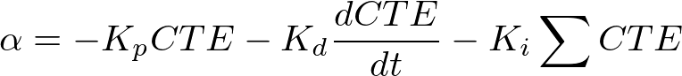

# CarND-Controls-PID

## Project Submission
1. Clone/fork the project's template files from the [project repository](https://github.com/udacity/CarND-Controls-PID) and have a look at the [rubric here](https://review.udacity.com/#!/rubrics/824/view). (Note: Please do not submit your project as a pull request against our repo!)
2. Build a PID controller and tune the PID hyperparameters by applying the general processing flow as described in the previous lessons.
3. Test your solution on the simulator!
4. When the vehicle is able to drive successfully around the track, submit! Remember to include a file addressing the reflection portion of the project in .txt, .md, .html, or .pdf format.
5. Try to see how fast you get the vehicle to **SAFELY** go!

---

## [Rubric Points](https://review.udacity.com/#!/rubrics/824/view)
### Compilation
- Your code should compile.

### Implementation
- The PID procedure follows what was taught in the lessons.

### Reflection
- Describe the effect each of the P, I, D components had in your implementation.
- Describe how the final hyperparameters were chosen.

### Simulation
- The vehicle must successfully drive a lap around the track.

---

## Writeup
### Implementation
Udacity Simulator provide **Cross Track Error(CTE)** value.  
So, I implementated PID controller to calculate the steering value.  
I implementated PID controller in [PID.cpp](https://github.com/atinfinity/CarND-PID-Control-Project/blob/master/src/PID.cpp).  
My implementation has the following method.

* Initialize PID parameters
* Update the PID error
* Calculate the total PID error

#### Initialize PID parameters
At first, this method initialize PID errors and PID coefficients.

```c++
void PID::Init(double Kp_, double Ki_, double Kd_) {
	// initialize errors
	p_error = 0.0;
	d_error = 0.0;
	i_error = 0.0;

	// initialize coefficients
	Kp = Kp_;
	Kd = Kd_;
	Ki = Ki_;
}
```

#### Update the PID error
This method calculate PID error using provided CTE value by simulator.

```c++
void PID::UpdateError(double cte) {
	double prev_cte = p_error;
	p_error = cte;
	d_error = cte - prev_cte;
	i_error += cte;
}
```

#### Calculate the total PID error
This method calculate total PID error using PID coefficients and PID error.

```c++
double PID::TotalError() {
	double total_error = -Kp * p_error -Kd * d_error -Ki * i_error;
	return total_error;
}
```

### Efect each of the P, I, D components
PID control is expressed by the following formula.



#### P component
In the above formula, **P component** has current error and proportional gain(Kp).  
So, **P component** can converge to the target quickly. But, overshoot and oscillations will occur when proportional gain(Kp) is too large.

#### D component
In the above formula, **D component** has derivatived error and derivative gain(Kd).  
So, **D component** can suppress overshoot and oscillations.

#### I component
In the above formula, **I component** has accumulated error and integral gain(Ki).  
This control can redce steady-state error by using accumulated error.  
So, **I component** can correspond to Systematic Bias.

### How to tune hyperparameters
I used Twiddle algorithm to tune hyperparameters.  

And, I implemented Twiddle algorithm in [main.cpp](https://github.com/atinfinity/CarND-PID-Control-Project/blob/master/src/main.cpp#L66-L163).  When **twiddle** variable set to true, simulator runs the car with confidents till the maximum steps set initially and go through the twiddle algorithm.  
After competition of each iteration, simulator reset to initial stage and car runs starts from the beginning to maximum steps. This process continuous until tol value below the allowed value.

### Simulation
My result on simulator is [pid_tuned_result.mp4](https://github.com/atinfinity/CarND-PID-Control-Project/tree/master/movies/pid_tuned_result.mp4)
